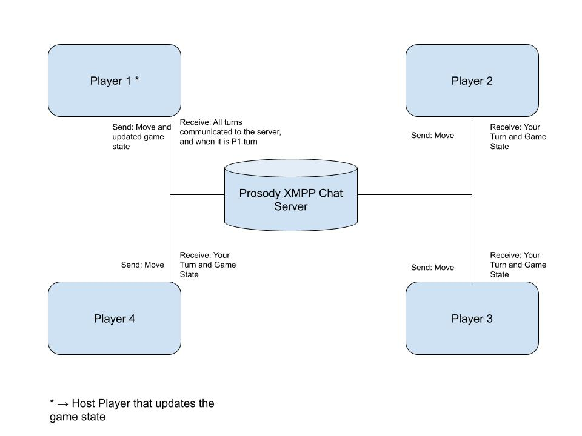

# Uno.rs

### The Product
As a team, we plan to build a CLI implementation of the card game Uno. It will be an online game for 2-4 players. The deck will be shuffled and the cards distributed among the players who will each play one at time; until there's a winner.

### Must haves
- A 3 player P2P online game.
- A shuffling mechanism.
- Server implementation over XMPP using the server Prosody (https://prosody.im/).
  - Using a third party XML parser to make and parse requests.
- CLI interface with a {number}{first_letter_of_color} scheme.
- Help command to give player possible commands.
- We have 2 possibility for the flow
  - We send the state with every message to each player in which case one player doesn't need to support the full load but then encryption is ever more important to ensure players don't check other player's cards.
  - One player is the main hub through which all XMPP requests go through, in which case we really only need to worry about the host checking other people's cards.

### Reaches
- Adding scalability for up to 4 and down to 2.
- Security/encryption.
  - Using hash functions for distributed shuffling as well as for access to cards.
- Timeout features in case a player disconnects or is AFK for too long which will either boot them from the game and add their cards to the deck and shuffle, or proclaim the last player victor.

### Difficulties
- Setting up server and getting communication of XMPP to work.
- Vulnerabilities in security regarding deck access and player host.
- Finding a good way to encrypt this non trivially but in a way that we can implement (at our level of understanding).
- A good, fair and as random as possible shuffle implementation.
- Working with possible microservices might be trickier than we think.

### Testing
- Our unit testing will be focused on the testing of game rules and communication over XMPP. The flow of the actual game will have to be on the user level, so the focus will be on whitebox rather than blackbox testing.
- Use cases: Nerds who want to play CLI uno, like us.

### API Sketch

The player object would include an ID as well as their hash function for shuffles and deck access.